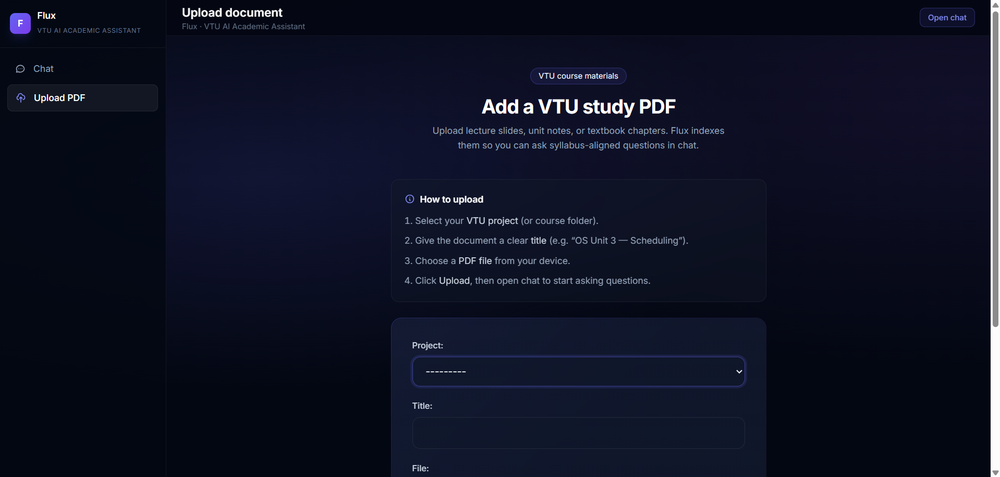

# Flux — VTU AI Academic Assistant

Flux is a local AI-powered academic assistant built for VTU students using Django, ChromaDB, and Ollama.

It uses Retrieval-Augmented Generation (RAG) to answer questions from uploaded academic PDFs using semantic search and local LLM inference.

---

## Features

- AI-powered VTU academic assistant
- Local RAG pipeline using ChromaDB
- Ollama Phi3 integration
- Semantic PDF retrieval
- Streaming-style AI responses
- Source citations
- Modern chat UI
- Markdown rendering
- Intelligent query routing
- Dark modern interface

---

## Tech Stack

- Django
- Ollama
- Phi3
- ChromaDB
- Sentence Transformers
- JavaScript
- TailwindCSS

---

## Architecture

1. Upload PDF documents
2. Extract and chunk text
3. Generate embeddings
4. Store embeddings in ChromaDB
5. Retrieve relevant chunks
6. Send context to local LLM
7. Generate AI response with citations

---

## Setup

```bash
git clone <repo-url>

cd flux

pip install -r requirements.txt

python manage.py runserver
```

Make sure Ollama is installed and running locally with:

```bash
ollama run phi3
```

---

## Future Improvements

- True token streaming
- Conversation memory
- Better document management
- Authentication system
- Deployment
- Advanced citation previews

---

## Screenshots


.png)

.png)



